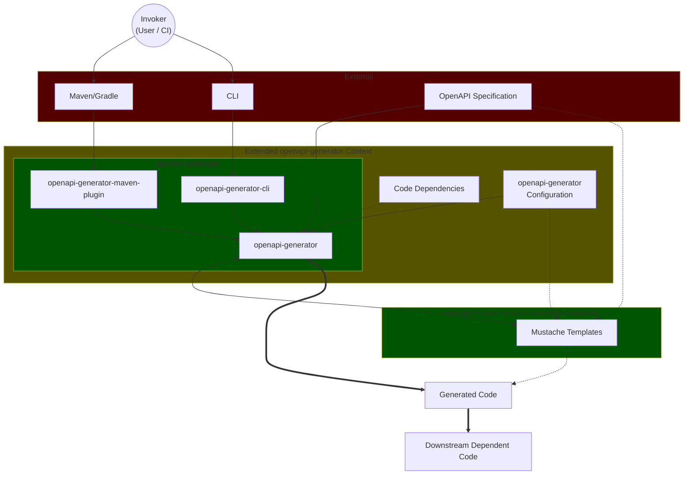

# Security Policy

> [!TIP]
> To discuss issues privately, reach out via [openapi2javarecords@protonmail.com](mailto:openapi2javarecords@protonmail.com).

## Supported Versions

| Version |     Supported      |
|:-------:|:------------------:|
|   3.x   | :white_check_mark: |
|   2.x   | :white_check_mark: |
|  < 2.0  |        :x:         |

## Reporting a Vulnerability
> [!CAUTION]
> If you discover a potential security vulnerability within the `.mustache` templates of this project, please do not use the public issue tracker. Instead, follow these steps:

### 1. **Private Disclosure**
Please report vulnerabilities by [opening a Draft Security Advisory](https://github.com/Chrimle/openapi-to-java-records-mustache-templates/security/advisories/new) on GitHub.
Or, provide details via [openapi2javarecords@protonmail.com](mailto:openapi2javarecords@protonmail.com).

### 2. **Response Time**
You can expect an initial acknowledgement of your report within 48–72 hours.

### 3. **Disclosure Process**
Once a fix is ready and a new version is published, a public security advisory will be released to credit your discovery and notify the community.

> [!NOTE]
> This allows for a private conversation between you and the maintainer.
> You may opt-out of the credit and remain anonymous, if desired.

## Security Best Practices
> [!CAUTION]
> Since these templates are used for code generation, users should adhere to the following:
> - **Inspect OpenAPI Spec**
>   - Ensure your source OpenAPI specification files are from a trusted source.
> - **Dependency Management**
>   - Use Dependabot or similar tools to stay updated with the latest template versions.
> - Only retrieve these `.mustache` templates from **Official Sources**!
>   - GitHub Packages
>   - Maven Central
> - **Review Files Used When Generating**
>   - **ALWAYS** secure that _input_-files (such as `.mustache` files) are authentic, that no _unexpected_ files are downloaded and/or retrieved, and only trusted files are used for code generation.
>   - It is recommended to explicitly state what files you expect to retrieve from this project, i.e., do not retrieve any arbitrary files like: `*/*` or `*.mustache`.
>   - Instead, import these files located in `templates/` explicitly:
>     - `generateBuilders.mustache`
>     - `javadoc.mustache`
>     - `licenseInfo.mustache`
>     - `modelEnum.mustache`
>     - `pojo.mustache`
>     - `useBeanValidation.mustache`
> - **Review Generated Code**
>   - **ALWAYS** secure that resulting files - _whether new, modified or removed_ - are as expected.

# Project Architecture

> An overview of the entities, contexts and domains within and surrounding this project.
> The purpose of the following diagram, is to highlight key "actors" or entities in the complete use-case of this project.
> Each entity presented **SHOULD** be considered having some impact of the resulting _Generated Code_, and **SHOULD** hence also be considered a point of risk.
> Arrows indicate information/data flow, where _solid lines_ indicate a _direct_ influence, while _dotted lines_ **MAY** have an _indirect_ influence.
> E.g. the OpenAPI Specification is directly used in openapi-generator, which will indirectly affect the Mustache Templates.

